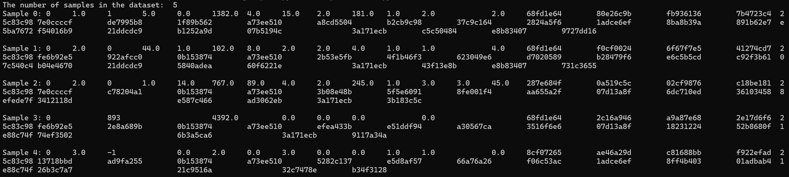

# Process the raw data
如下图所示，criteo 的原始数据输出如下：


数据包含一个目标标签（lable）：
- 13 个稠密特征，也即数值特征，分别命名为 `I1` 到 `I13`；
- 26 个稀疏特征，也即类别特征，分别命名为 `C1` 到 `C26`。

## 问题2
数据处理

### `Process_Data` 实现说明

`Process_Data(data_path)` 负责将原始 TSV 文件转换为模型可直接消费的 DataFrame，返回值为：

```
data, sparse_vocab_size, dense_features, sparse_features
```

#### 处理流程

| 步骤 | 操作 | 说明 |
|------|------|------|
| 1 | 定义列名 | `label` + `I1`–`I13`（稠密）+ `C1`–`C26`（稀疏） |
| 2 | 读取 TSV | `pd.read_csv(sep='\t', header=None)` |
| 3 | 填充缺失值 | 稠密特征填中位数（对长尾分布鲁棒）；稀疏特征填 `"unknown"`（作为独立可编码类别） |
| 4 | 归一化稠密特征 | `MinMaxScaler` → `[0, 1]`，适配 MLP 输入 |
| 5 | 编码稀疏特征 | `LabelEncoder` 逐列编码，将哈希字符串映射为从 0 开始的整数索引，供 `nn.Embedding` 使用 |
| 6 | 统计词表大小 | `sparse_vocab_size = {col: nunique()}` 用于确定每个 Embedding 表的行数 |

#### 关键设计选择

- **中位数填充（稠密）**：点击计数类特征分布极度右偏，中位数比均值更能代表典型值，避免极端值干扰归一化结果。
- **`"unknown"` 填充（稀疏）**：保留缺失样本，不丢弃数据行；缺失值被视为一个独立类别参与训练。


## 问题1

### 问题描述
数据集太大，无法通过readCSV的方式全部读取

### 解决方法
自动检查：检测是否已经存在一个同名的 .parquet 文件（比如你的输入是 train.txt，它会自动去找 train.parquet）。
极速读取：如果有这个 .parquet，它就不会再去跑耗时的 Pandas 逐行字符串解析和 LabelEncoder 了，而是直接 pd.read_parquet(parquet_path) 几秒钟读入内存。
静默生成：如果你是第一次跑（或者把原始 TXT 文件换了路径没有成套的 parquet），它会先正常读 TXT、做清洗和归一化、做 Label Encode，并且在处理完后自动调用 data.to_parquet(...) 保存在旁边。
### 
原因 

### 解决方式分块读取