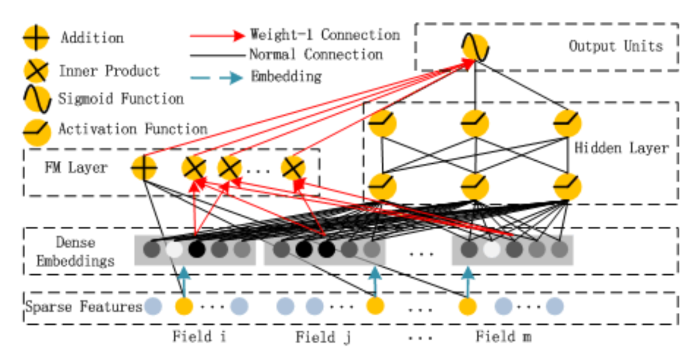
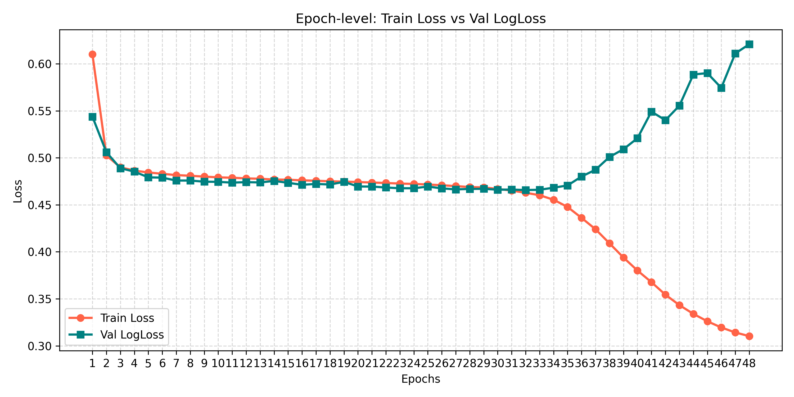
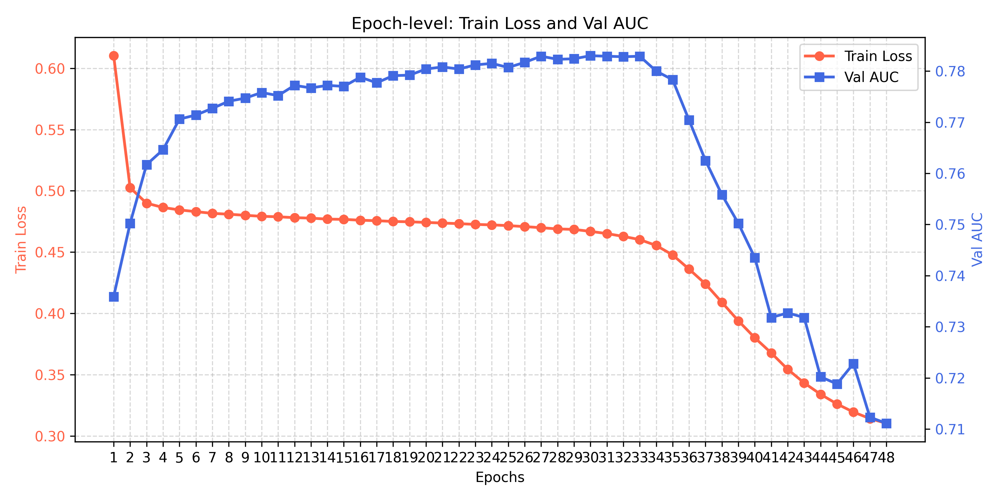
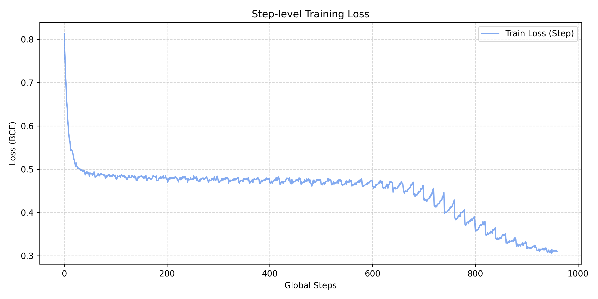
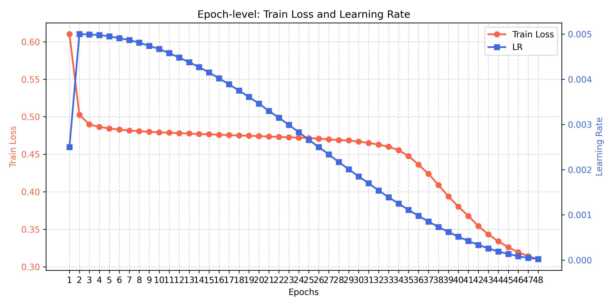

# DeepFM学习笔记

**目录：**
- [CTR任务简介](#ctr任务简介)
- [DeepFM方案](#deepfm方案)
    - [DeepFM架构](#deepfm-架构)
    - [DeepFM](#deepfm-数据流)
- [DeepFM实践](#deepfm实践)
    - [数据处理](#数据处理)
    - [网络框架](#网络框架)
    - [训练框架](#训练框架)
    - [训练结果](#训练结果)
- [常见问题](#常见问题)
    - [数据处理](#数据处理-1)
    - [模型训练](#模型训练)
    - [指标选择](#指标选择)

## CTR任务简介

> [!NOTE]
>
> 该部分主要对于CTR任务进行介绍，并且对CTR任务常见的数据进行科普。

对推荐场景来说，CTR（Click-Through Rate）是最关键的指标，除了广告系统会按照CTR x bid来进行排序之外，推荐系统一般都会严格地按照预估的CTR进行排序，所以这其中的关键问题就是准确地预估CTR。

一般来说常规的推荐系统当中的特征分为四个部分，第一个部分是**用户特征**，是关于用户的一些信息。比如是男是女，是否是高收入群体，是否是高消费群体，成为平台的用户多久了，偏好平台当中什么类目的商品等等。第二个部分是**商品特征**，就是关于item的一些信息，比如价格、类目、折扣、评价等等。第三个部分是**上下文特征**，比如当前的时间，是早上还是晚上，比如item展示的位置等等。最后一个部分是**用户实时的行为**，比如用户在浏览这个商品之前还看过哪些其他的商品，他登陆平台多久了，等等。

但是实际上，这些特征可以由两部分组成，第一部分是**类别特征**，比如性别、地理位置、收入情况等等。第二种是**连续性特征**，比如平均花费、平均停留时间等等。类别特征（categorical feature）一般被表示成一个one-hot之后的向量，而一个连续特征，一般就是表示它自己，当然也可以离散化成one-hot向量。

显然用户是否会点击某一个 item 是由以上信息共同作用的，而交叉信息往往是隐式的，是不能直接描述和形容出来的。因此带来的一个关键挑战就是**如何高效地对特征之间的交叉信息进行建模**，其中的一些比较容易理解，也比较容易做出特征来，然而大部分的交叉信息是隐式的，难以直观理解的，比如啤酒和尿布的例子就是一个，只有大数据挖掘才能发现。即使是直观上容易理解的部分，由于涉及的数量太大，也不可能通过手工来全部处理。

## DeepFM方案

在 DeepFM 提出之前，现有的模型存在一些关键的局限性：
- **FM (因式分解机)**: 非常擅长提取二阶特征交互，但在学习复杂、高阶、非线性关系时表现吃力。
- **DNN (深度神经网络)**: 善于捕获高阶模式，但在捕获低阶稀疏特征交叉信息时效率低下。
- **Wide & Deep**: 结合了线性模型和深度模型，但是其 "Wide" 部分仍然需要大量的领域知识来进行人工特征工程（例如，特征交叉积变换）。

为了填补这些空白，DeepFM 被提出，旨在单一的统一架构中自动学习低阶和高阶的特征交互。DeepFM (Deep Factorization Machine) 是一种为点击率 (CTR) 预测设计的端到端神经网络模型。它优雅地解决了 CTR 任务中的一个核心问题：如何在不需要人工特征工程的情况下，全面且同时地捕获简单（低阶）和复杂（高阶）的特征交互。它是因式分解机 (FM) 和深度神经网络 (DNN) 的结合体，并且这两部分共享相同的输入 Embedding 空间。

**DeepFM 的优势：**

1. **无需人工特征工程**: 与 Wide & Deep 不同，DeepFM 的 FM 模块能自动学习特征交互，消除了繁琐的人工特征交叉配置。
2. **共享 Embedding (Shared Embeddings)**: FM 和 DNN 组件共享完全相同的 Embedding 层。这种同时存在的双重监督（来自低阶和高阶路径的梯度反馈）使得 Embedding 表示能够被学习得更加准确。
3. **端到端训练 (End-to-End Training)**: 它同时对网络的所有组件进行联合训练，不需要预训练（不像 FNN 等需要预训练 FM 的模型）。

### DeepFM 架构

> [!NOTE]
>
> 这一部分主要介绍 DeepFM 的构成，以及其的两个组件：FM 和 DNN。





* **FM 因式分解器**
  * 这里包含两个部分：线性部分 (Linear Part) 和交互部分 (Interaction Part)。FM会考虑所有特征之间两两交叉的情况，相当于人为对左右特征做了交叉。但是由于n个特征交叉的组合是 $n^2$ 量级，所以FM设计了一种新的方案，对于每一个特征 $i$ 训练一个向量 $V_i $，当 $i$ 和 $j$ 两个特征交叉的时候，**通过 $V_i \cdot V_j$ 来计算两个特征交叉之后的权重**。这样大大降低了计算的复杂度。
  * **线性部分 (linear part)**：捕获每个特征的一阶效应，也可以被看作是一个逻辑回归 (Logistic Regression)。
  * **交互部分 (interaction part)**：使用 Embedding 向量捕获二阶特征组合。这种设计使得 FM 能够高效地对稀疏且高维的输入进行建模。

* **DNN 深度神经网络**
  * CTR 预估的模型和图片以及音频处理的模型有一个很大的不同，就是它的维度会更大，并且特征会非常稀疏，还伴有类别连续、混合、聚合的特点。在这种情况下，使用 embedding 向量来把原始特征当中的信息压缩到低维的向量就是一种比较好的做法了，这样模型的泛化能力会更强，要比全是01组成的 multi-hot 输入好得多。
  * DNN 即深度神经网络 (Deep Neural Network)，用于学习高阶和非线性的特征交互。在 DeepFM 中，特征的 Embedding向量被拼接在一块，并通过带有非线性激活函数的多个全连接层。
  * 最终将 DNN 的输出与 FM 的输出结合起来，这样模型就可以通过端到端的方式，联合捕获低维和高维的模式特征。

### DeepFM 数据流

> [!note]
> 该部分对在Pytorch 中进行针对 DeepFM 的搭建和训练进行汇总和总结
>
**数据流与张量形状（前向传播） (Data Flow & Tensor Shapes):**

* 输入层 (Input layer): `[batch_size, num_fields]`

- 嵌入层 (Embedding layer): `[batch_size, num_fields, embedding_size]`

* **分支 1：FM (因式分解机 Factorization Machine)**

  - 一阶输出 (线性 / Linear): `[batch_size, 1]` $\rightarrow$ `res_1st`

  - 二阶输出 (交互 / Interaction): `[batch_size, 1]` $\rightarrow$ `res_2nd`


* **分支 2：DNN (深度神经网络 Deep Neural Network)**

  - 展平输入 (Flattened Input): `[batch_size, num_fields * embedding_size]`

  - 隐藏层 (Hidden layers): `[batch_size, hidden_units]` 

  - DNN 输出 (DNN Output): `[batch_size, 1]`


* **最终输出 (Final Output):**

  - 合并运算: `res_1st + res_2nd + res_dnn` $\rightarrow$ `[batch_size, 1]`

  - 预测结果 (Prediction): `Sigmoid(Logits)` $\rightarrow$ `[batch_size, 1]` (概率输出)

## DeepFM实践

### 数据处理

由于 Criteo 数据集训练集大小为 10G 左右，测试集大小为 2G 左右，在个人设备以及单卡上训练非常困难，出于成本和现实的考虑，从原始的Criteo数据集中随机采样 1,000,000 条数据作为训练集。

```python
def sample_text_file(input_path, output_path, num_samples, seed=42):
    """Randomly sample lines from a text file and write them out."""
    import random
    from tqdm import tqdm

    # Reservoir sampling keeps memory usage bounded even for large files.
    reservoir = []
    random.seed(seed)

    with open(input_path, "r", encoding="utf-8") as f_in:
        for idx, line in enumerate(tqdm(f_in, desc="Sampling", unit=" lines")):
            if idx < num_samples:
                reservoir.append(line)
            else:
                j = random.randint(0, idx)
                if j < num_samples:
                    reservoir[j] = line

    if len(reservoir) < num_samples:
        raise ValueError(
            f"Not enough samples: requested {num_samples}, got {len(reservoir)}"
        )

    with open(output_path, "w", encoding="utf-8") as f_out:
        f_out.writelines(reservoir)
```

### 网络框架

参考开源库`torch-rechub`进行搭建，整体架构如下：

```python
class DeepFM(torch.nn.Module):
    def __init__(self, deep_features, fm_features, mlp_params):
        super(DeepFM, self).__init__()
        self.deep_features = deep_features # 用于送入 DNN 的特征
        self.fm_features = fm_features # 用于送入 FM 的特征
        
        self.deep_dims = sum([fea.embed_dim for fea in deep_features])
        self.fm_dims = sum([fea.embed_dim for fea in fm_features])
        
        self.linear = LR(self.fm_dims)  # 1-odrder interaction
        self.fm = FM(reduce_sum=True)  # 2-odrder interaction
        self.embedding = EmbeddingLayer(deep_features + fm_features)
        self.mlp = MLP(self.deep_dims, **mlp_params)

    def forward(self, x):
        # [batch_size, num_fields, _] -> [batch_size, num_fields, embed_dim]
        input_deep = self.embedding(x, self.deep_features, squeeze_dim=True)  
        input_fm = self.embedding(x, self.fm_features, squeeze_dim=False)
        # [batch_size, num_fields, embed_dim] -> [batch_size, 1]
        y_linear = self.linear(input_fm.flatten(start_dim=1))
        y_fm = self.fm(input_fm) # [batch_size, 1]
        y_deep = self.mlp(input_deep)  # [batch_size, 1]
        y = y_linear + y_fm + y_deep
        return torch.sigmoid(y.squeeze(1))
```

对于 embedding 层的设计，示意如下：

```
最小示例：2 个 sparse + 1 个 dense，batch=3

设定:
- sparse 特征: s1, s2
- dense 特征: d1
- embedding 维度: D=4
- batch 大小: B=3

输入 x:
- x["s1"] = [2, 0, 5]      -> shape (3,)
- x["s2"] = [1, 3, 2]      -> shape (3,)
- x["d1"] = [0.2, 1.5, -0.7] -> shape (3,)

forward 流程:

1) 处理 s1 (SparseFeature)
- embedding lookup: (3,) -> (3, 4)
- unsqueeze(1): (3, 4) -> (3, 1, 4)
- append 到 sparse_emb 列表

2) 处理 s2 (SparseFeature)
- embedding lookup: (3,) -> (3, 4)
- unsqueeze(1): (3, 4) -> (3, 1, 4)
- append 到 sparse_emb 列表

3) 处理 d1 (DenseFeature)
- float 后若是一维就 unsqueeze(1): (3,) -> (3, 1)
- append 到 dense_values 列表

4) 列表拼接
- sparse_emb = torch.cat(sparse_emb, dim=1)
  [(3,1,4), (3,1,4)] -> (3, 2, 4)

- dense_values = torch.cat(dense_values, dim=1)
  [(3,1)] -> (3, 1)

输出分支:

A. squeeze_dim=False
- 返回 sparse_emb
- 输出 shape: (3, 2, 4)
- 适合 FM（保留 field 维）

B. squeeze_dim=True
- sparse_emb.flatten(start_dim=1): (3,2,4) -> (3,8)
- 与 dense_values 拼接: torch.cat([(3,8), (3,1)], dim=1)
- 输出 shape: (3, 9)
- 适合 MLP（每个样本一行向量）
```

其中，对于 FM 部分的一阶输出和二阶输出都使用了 Embedding 后的特征，而没有直接使用稀疏的类别特征。同时，原始论文中并没有提及针对数值这种稠密特征如何处理，这里可以利用分桶离散的方法，将其离散为稀疏的类别特征，和其他类别特征拼接后一起输入。

```python
# 特征定义
use_bucketized_dense = (dense_mode == 'bucketize_as_sparse')
if use_bucketized_dense:
    dense_feature_objs = ['''将 dense_feature_objs 转化为 sparse_feature_objs，采用分桶离散 ''']
else:
    dense_feature_objs = ['''保持 dense_feature_objs 不变''']
sparse_feature_objs = ['''提取稀疏特征类别''']

deep_feature_objs = dense_feature_objs + sparse_feature_objs
print(f"Deep features: {[fea.name for fea in deep_feature_objs]} (total {len(deep_feature_objs)})")

# 分桶后的 dense 会作为 sparse 参与 FM；否则 FM 仅使用原始 sparse。
fm_feature_objs = deep_feature_objs if use_bucketized_dense else sparse_feature_objs
print(f"FM features: {[fea.name for fea in fm_feature_objs]} (total {len(fm_feature_objs)})")

# 模型
model = DeepFM(
    deep_features=deep_feature_objs,
    fm_features=fm_feature_objs,
    mlp_params={'dims':mlp_dims, 'dropout':dropout, 'activation': 'relu',}
).to(device)
```


### 训练框架

```python
"""
train.py
"""

# Part1: import the needed lib
'''Your Code Here'''

# Part2: Seed setting
'''Your Code Here'''

# Part3: Logger Setting
'''Your Code Here'''

# Part4: Define train() and val() function for one epoch
def train():
    ''' Your Code Here'''
    return 

@torch.no_grad()
def evaluate():
    ''' Your Code Here'''
    return 

# Part5: Define main() function to start the main procession
def main():
    # Part5.1 Hyparameters setting
    '''Your Code Here'''
    # Part5.2 Create Dataset for Train and evalute
    '''Your Code Here'''
    # Part5.3 Create DataLoader for Train and evalute
    '''Your Code Here'''
    # Part5.4 Define model for training
    '''Your Code Here'''
    # Part5.5 Criterion, Optimizer, Schedule and etc. for training
    '''Your Code Here'''
    # Part5.6 Traing loop start
		for epoch in range(1, num_epochs + 1):
            '''Your Code Here'''

if __name__ == '__main__':
    main()
```

### 训练结果

最终训练在验证集上的指标为：**AUC=0.7835, LogLoss=0.4650**




可以看到模型在第 32 个 Epoch 左右在测试集上的性能，之后其开始发生过拟合现象。
训练使用的超参数如下：
| 参数 | 值 | 参数 | 值 |
|---|---|---|---|
| **batch_size** | 4096 | **dense_mode** | bucketize_as_sparse |
| **dropout** | 0.5 | **early_stop_min_delta** | 0.0001 |
| **early_stop_patience** | 15 | **embed_dim** | 32 |
| **fill_dense** | 0.0 | **fill_sparse** | unknown |
| **learning_rate** | 0.003 | **min_lr** | 1e-06 |
| **mlp_dims** | [256, 128, 64] | **num_epochs** | 40 |
| **num_workers** | 16 | **scheduler_type** | cosine |
| **sparse_mode** | hash | **warmup_epochs** | 5 |
| **weight_decay** | 0.001 |  |  |

## 常见问题

### 数据处理

**数据的缺失**

由于原始数据集中含有大量的缺失值，需要针对不同类型的特征采取结构化的填补策略：
1. **数值特征（Dense Features）**：通常使用均值、中位数填补，或者简单地用 `0` 填补。在广告和推荐场景下，由于数据的客观稀疏性，很多数值的缺失往往意味着“没有发生相关交互”，此时填补 `0` 是一种符合业务直觉且高效的做法。
2. **类别特征（Sparse Features）**：通常将缺失值作为一个全新的独立类别对待（例如标记为 `-1` 或是 `<UNK>`），通过 Embedding 网络去挖掘“属性缺失”本身所带有的隐式信息。

**数据集过大**

如果想要运行原始的 10G 数据集，可以使用 `numpy` 压缩为 `.npz` 文件，降低内存压力；或者通过随机采样，取出一个基于采样的小数据集用于测试与训练。

**数值特征和类别特征如何统一**

DeepFM 等深度学习推荐模型必须要同时处理离散类别特征和连续数值特征。我们有两种常见方式来统一它们：
1. **分桶离散化（Bucketize）**：将连续的数值特征按照一定分位数或者区间切分成多个“桶”，使其转化为类别特征（如本项目提到的 `bucketize_as_sparse` 模式）。转变后，数值特征也通过 Embedding 学习到了对应桶的向量交互表示，这使得模型能够在 FM 侧捕捉数值特征与其他特征的二阶交叉信息。
2. **归一化后拼接**：如果不做分桶，数值特征需要进行 Min-Max 归一化或标准化处理（否则量纲差异将直接导致网络梯度震荡且难以收敛）。处理后，将数值标量直接拼接在 Embedding 输出的特征向量后面，统一喂给 MLP 层学习高阶表示。


### 模型训练

**损失函数的选择**

这里损失函数选择**对数损失（LogLoss 或 BCELoss，二元交叉熵）**。理由：CTR 预估本质上是对用户点击概率的预测，是一个典型的二分类问题。对数损失直接对模型输出概率的分布偏离程度进行惩罚，十分契合评估“概率预估准确性”的需求。

**学习率的选择**

学习率的选择十分重要，为了更好的训练效果采用余弦衰减和 warm up 的训练策略。从 `5e-4`开始衰减，衰减至`1e-6`后保持不变。

由于采用余弦衰减，如果 epoch 轮数过多，会导致学习率下降过慢，导致训练在前期发散，从而早停；如果不采用学习率衰减又会导致后续训练效果不佳，因此要合理控制 epoch 轮数，和初始的学习率值，当前实验中，初始学习率为0.003，轮数为 40 轮，这样可以保证模型得到充分训练。

**训练过拟合**

由于采用的是采样后的小数据，容易出现过拟合现象，因此可以采用一些压缩模型表达方式的方法进行降低过拟合：

* `dropout：`在 MLP 中添加随机失活层，可尝试的参数：`0.5`、`0.6`、`0.7`、`0.8`
* `weight_decay`：正则化参数，可尝试的参数：`1e-3`、`1e-4`
* `mlp_params`：MLP 隐藏层维度，可尝试的参数：`[256, 128, 64]`、`[128, 64]`、`[128, 64 ,32]`

### 指标选择

**性能评估指标**

采用 **AUC（Area Under ROC Curve）** 和 **LogLoss** 作为核心评估指标：
1. **AUC**：评估模型的**排序能力**，即判断模型把真实的点击样本排在未点击样本前面的概率。CTR 任务面临极度不平衡的正负样本分布（绝大部分都是不点击），传统的准确率（Accuracy）容易失效，而 AUC 对样本类别比例的不平衡具有极好的鲁棒性。
2. **LogLoss**：评估模型的**预估绝对准确率**。在工业界推荐与广告系统的下游竞价策略中，经常需要对真实的概率值进行出价计算（例如 $\text{eCPM} = pCTR \times \text{Bid}$），此时不仅需要模型“排得准”，还需要“打分精确”。LogLoss 直接衡量了预估概率与真实标签间的收敛状态。
